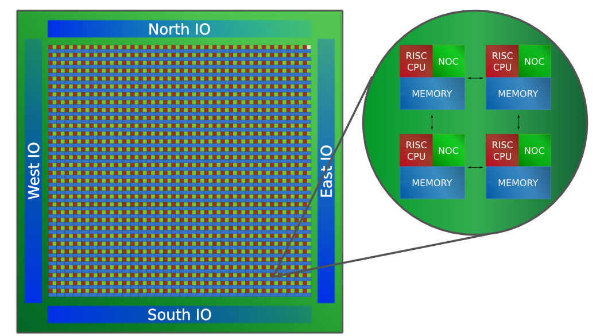
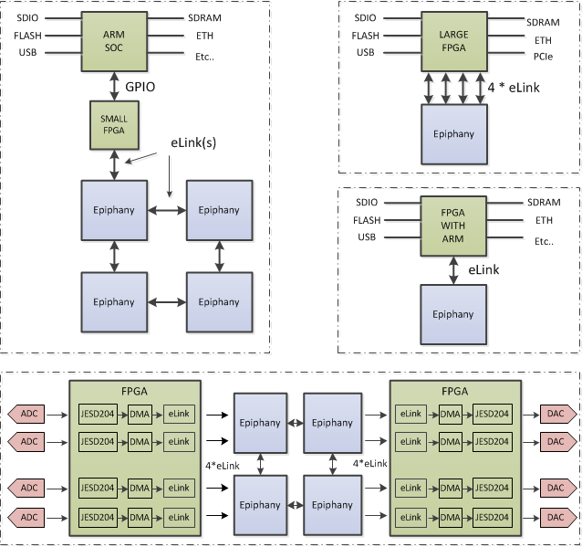

Chapter 1: Introduction
=========================================================================

The Epiphany architecture is a distributed shared memory architecture comprised of an array of processor nodes communicating via a low-latency mesh Network-on-Chip ("NOC"). Each node in the processor array is a complete processor capable of running an operating system ("MIMD"). Epiphany uses a flat memory model, in which all distributed memory is readable and writable by all processors in the system. 

Each Epiphany RISC processor is programmable in ANSI-C/C++ using a standard open source GNU tool chain based on GCC and GDB. Epiphany is programing model neutral and supports a number of parallel programming approaches, including:

* Single Instruction Multiple Data (SIMD)
* Single Program Multiple Data (SPMD)
* Host-Slave Accelerator Programming
* Multiple Instruction Multiple Data (MIMD)
* Static and dynamic dataflow
* Fork-join
* Message-passing
* Communicating sequential processes (CSP)
* Bulk Synchronous Processing (BSP)

Parallel programming frameworks currently available for Epiphany include:

* OpenMP
* MPI
* OpenSHMEM
* OpenCL
* Erlang
* BSP
* Epython
* CAL

The Figure below illustrate a few of the many possible Epiphany system solutions.

\newpage

